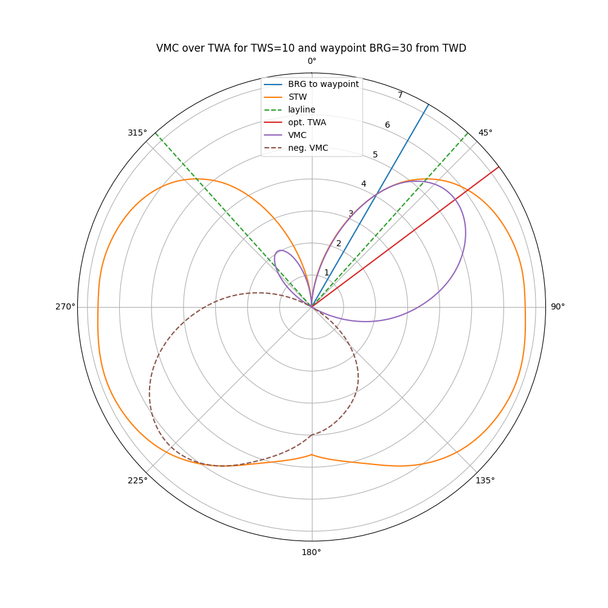

# Magnetic Variation

The plugin is able to calculate the [magnetic variation](https://en.wikipedia.org/wiki/Magnetic_declination) at your current position.
It is using the [World Magnetic Model](https://www.ncei.noaa.gov/products/world-magnetic-model).
The WMM2020 Coefficient file ([wmm2020.cof](../Sail_Instrument/lib/WMM2020.COF)) valid for 2020 - 2025 is included in the software package. The calculation is done with the [geomag-library](https://github.com/cmweiss/geomag). The coefficient file and the library are located in the [`lib` subdirectory](../Sail_Instrument/lib).

# Polar Data

You have to provide polar data for your boat in `avnav/user/viewer/polar.json` for calculating the laylines, polar speed and optimum VMC course. If there is no such file, the plugin will copy [an example file](../Sail_Instrument/polar.json) to this location, and you can use it as a template for your own polar data.

If you do not have any polar data, you can enter tack and gybe angle in the plugin configuration and use these fixed values instead.

A source for polar data can be [ORC sailboat data](https://jieter.github.io/orc-data/site/) or [Seapilot.com](https://www.seapilot.com/features/download-polar-files/).

# Leeway estimation

Leeway is [estimated from heel and STW](https://opencpn-manuals.github.io/main/tactics/index.html#_2_2_calculate_leeway) as

LEE = LEF * HEL / STW^2

With LEF being a boat specific factor from within (0,20). Heel could be a measured value (either from `signalk.navigation.attitude.roll` or a specific transducer in `gps.transducers.ROLL`). If this data is not available it is interpolated from the heel polar in [`avnav/user/viewer/heel.json`](../Sail_Instrument/heel.json). As the `polar.json` it contains an interpolation table to map TWA/TWS to heel angle HEL.

# Laylines

To understand the technical background of the laylines one has first to have an understanding of the terms VMG and VMC.

- **VMG** - _Velocity Made Good against
  wind_ is defined as `VMG = boatspeed * cos(TWA)` boatspeed vector projected onto true wind direction
- **VMC** - _Velocity Made good on
  Course_ is defined as `VMC = boatspeed * cos(BRG-HDG)` boatspeed vector projected onto direction to waypoint

Unfortunately there is a lot of confusion on these two terms and also most of the commercial products are mixing the two items and indicate VMG but actually showing VMC (and so does AvNav).

The laylines are computed from the `beat_angle` and `run_angle` vectors in the polar file, which contain a mapping of TWS to TWA for maximum VMG. As a result the laylines show the optimal TWA to travel upwind in general, but not the optimal TWA to get towards the waypoint.
Optionally it is also possible to calculate the laylines from the STW matrix.

From the `STW` matrix in the polar data, which is a mapping of TWS and TWA to STW, one can calculate the _optimal
TWA_ (red) such that _VMC is maximised_ (purple), 